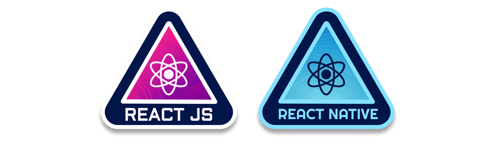
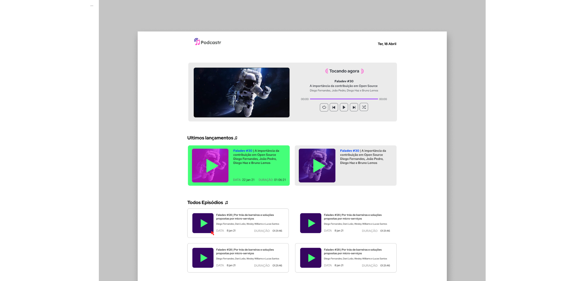

# <center> Next Level Week #5 🚀 </center>

<!--  -->


## 📋 Table of Contents

- [Project 1:  Podcastr](#projet-1-podcastr)
- [Project 2: Plant Manager](#project-2-plant-manager)
---


# 🚀 **Project 1 Podcastr**
Aplicação web para ouvir podcasts, criada com NextJS (framework React) para aplicações SSR(Server Side Rendering)

##  📷  Screenshots



## 📡 Technologies

Stack usada no projeto:
* NextJS 10.1
* Axios 0.21

## 🧰 Setup
Para abrir o projeto instale e use o Yarn:
```
$ npm install --global yarn
```

```
# // Clone this repository 
$ git clone https://github.com/eessgg/NextLevelWeek05.git

# // Go into the repository 
$ cd podcaster-next/

# // Run server
$ yarn server   
$ yarn dev
```

## 🎉Launch

``http://localhost:3000/``


---

# 🚀 Project 2: Plant Manager | Reatc Native
<!-- What is your project? -->

Aplicação mobile para gerenciamento de plantas em casa e no jardim, com lembretes de água.

##  📷  Screenshots


## 📡 Technologies

Setup usada no projeto:
* React Native
* Expo
* Axios
* Local Storage

## 🧰 Setup
Para abrir o projeto instale e use o Yarn:
```
$ npm install --global yarn
```


```
# // clone this repository 
$ git clone https://github.com/eessgg/NextLevelWeek05.git
$ npm install

# // Go into the repository 
$ cd podcaster-next/

# // Run server
json ./src/services/server.json --host *YOUR_API_ADRESS* --port 3333

# // Run Expo
$ yarn dev
```

## 🎉Launch

Use o aplicativo [Expo](https://expo.io/client) para rodar o app no mobile.


